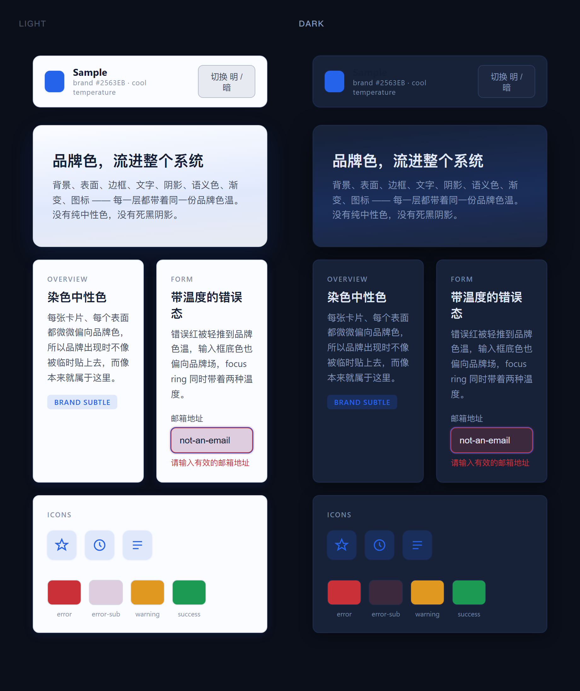

<a id="english"></a>

# tinted-ui-tokens-skills（品牌色 UI 设计 Token skills）

[](agents/)
[](#what-it-can-do)
[](#requirements)
[](LICENSE)

English | [中文](#chinese)

A **cross-agent** skill that turns one brand color into a complete,
production-ready **brand-tinted design-token system** — so your UI stops looking
cheap from flat neutral colors. It works in Claude Code, Cursor, OpenAI Codex,
Cline, Aider, WindSurf, GitHub Copilot, Gemini CLI, and WorkBuddy.

No pure neutral colors anywhere (`#FFFFFF`, `#000000`, `#808080`): every
background, surface, border, text layer, shadow, semantic color, gradient, and
icon picks up a few percent of the brand's temperature.

The engine (`scripts/generate_tokens.py`) is plain Python standard library and
runs anywhere Python 3.10+ is available. The instructions live in
[`INSTRUCTIONS.md`](INSTRUCTIONS.md) and are wired into each agent via the docs in
[`agents/`](agents/).



> Above: light + dark output for brand `#2563EB` (cool). Every surface, border,
> text layer, and semantic color is tinted toward the brand — the topbar title stays
> legible in both modes. Run the generator to get a live `preview.html` with a real
> light/dark toggle.

## Who This Is For

- Designers who want a premium, on-brand UI color system without hand-tuning dozens of gray values.
- Developers who want drop-in CSS variables for light + dark mode from a single hex.
- Teams that want a consistent "tinted neutral" language across products — and across the different AI coding agents they use.
- Anyone whose UI currently uses pure `#FFF` / `#000` / `#808080` and reads as "flat".

## What It Can Do

- Generate a full token system from **one brand color** (hex).
- Output `tokens.css` with `:root` + `[data-theme="dark"]` custom properties.
- Output a self-contained `preview.html` with a live light / dark toggle.
- Tint backgrounds, surfaces, borders, text hierarchy, shadows, semantic colors, gradients, and icons.
- Nudge semantic colors (error / warning / success) toward the brand temperature.
- Auto-detect warm / cool / balanced temperature from the brand hue.
- Work for **any** brand color (brand-agnostic generator, not two hard-coded palettes).

## Cross-Agent Compatibility

The skill is agent-agnostic: the engine is a Python script and the instructions
are a single paste-ready Markdown file. Each agent only differs in *where the rule
goes*. Full wiring steps are in [`agents/`](agents/).

| Agent | Rule / Command format | Install location | Engine | Status |
| --- | --- | --- | --- | --- |
| **Claude Code** | `SKILL.md` (skills) / `/command` | `~/.claude/skills/tinted-ui-tokens-skills/` | Python script | ✅ Supported |
| **Cursor** | `.mdc` rule | `.cursor/rules/` or `~/.cursor/rules/` | Python script | ✅ Supported |
| **OpenAI Codex** | `AGENTS.md` / `codex.md` | repo root or `~` | Python script | ✅ Supported |
| **Cline** | `.clinerules` / `.cline/rules/*.md` | project or `~/.cline/rules/` | Python script | ✅ Supported |
| **Aider** | `CONVENTIONS.md` (`--read`) | repo root | Python script | ✅ Supported |
| **WindSurf** | `.windsurfrules` | repo root or `~` | Python script | ✅ Supported |
| **GitHub Copilot** | `copilot-instructions.md` | `.github/` | Python script | ✅ Supported |
| **Gemini CLI** | `GEMINI.md` | repo root or `~` | Python script | ✅ Supported |
| **WorkBuddy** | `SKILL.md` (skills) | `~/.workbuddy/skills/tinted-ui-tokens-skills/` | Python script | ✅ Supported |

> All agents share the same engine and the same [`INSTRUCTIONS.md`](INSTRUCTIONS.md).
> Once cloned, point your agent's rule file at it (see the per-agent docs) and you are done.

## Quick Install

Clone the repo once, then point your agent at the matching rule file. Every agent
shares the same engine and [`INSTRUCTIONS.md`](INSTRUCTIONS.md).

```bash
git clone https://github.com/truman-t3/tinted-ui-tokens-skills ./tinted-ui-tokens-skills
```

| Agent | Wire it up |
| --- | --- |
| **Claude Code** | Move the cloned folder to `~/.claude/skills/tinted-ui-tokens-skills/` (the `SKILL.md` is picked up automatically) |
| **Cursor** | `cp tinted-ui-tokens-skills/agents/cursor/tinted-ui-tokens-skills.mdc .cursor/rules/` |
| **OpenAI Codex** | `cp tinted-ui-tokens-skills/agents/codex/AGENTS.md AGENTS.md` |
| **Cline** | `cp tinted-ui-tokens-skills/agents/cline/.clinerules .cline/rules/tinted-ui-tokens-skills` |
| **Aider** | `aider --read tinted-ui-tokens-skills/agents/aider/CONVENTIONS.md` |
| **WindSurf** | `cp tinted-ui-tokens-skills/agents/windsurf/.windsurfrules .windsurfrules` |
| **GitHub Copilot** | `cp tinted-ui-tokens-skills/agents/copilot/copilot-instructions.md .github/copilot-instructions.md` |
| **Gemini CLI** | `cp tinted-ui-tokens-skills/agents/gemini-cli/GEMINI.md GEMINI.md` |
| **WorkBuddy** | Copy the repo to `~/.workbuddy/skills/tinted-ui-tokens-skills/`, or install from the Skills panel |

> Full per-agent steps (global vs project scope, multiple projects) are in
> [`agents/`](agents/).

## Quick Start (any agent)

```bash
# 1. Get the engine + instructions
git clone https://github.com/truman-t3/tinted-ui-tokens-skills ./tinted-ui-tokens-skills

# 2. Run it directly (works in every agent's terminal)
python ./tinted-ui-tokens-skills/scripts/generate_tokens.py --brand "#2563EB" --name "Acme" --out "./out"
```

Then wire it into your agent by following the matching doc in
[`agents/`](agents/) (typically: paste `INSTRUCTIONS.md` into your agent's rule file).

## Example Workflows

- "Use `#2563EB` to generate a tinted token system" → get `tokens.css` + `preview.html`.
- Refresh an existing UI: drop `tokens.css` in and replace pure neutrals with the tinted set.
- Compare directions: generate for two brand colors and eyeball the previews.
- Hand-tune: change the blend factor in `build_tokens()` for a stronger or weaker tint.

## Requirements

- Python 3.10+ (standard library only — no `pip install` needed).
- Windows / macOS / Linux all supported (engine is pure Python).

## How to Use (WorkBuddy / Claude Code)

Invoke the skill by asking, for example:

> 用 `#2563EB` 出一套染色 Token 系统

The agent runs `scripts/generate_tokens.py` and presents `preview.html` + `tokens.css`.

For every other agent, follow its doc in [`agents/`](agents/).

## CLI Usage

```bash
python scripts/generate_tokens.py --brand "#2563EB" --name "Acme" --out "./out"
```

- `--brand` (required): any hex color.
- `--name` (optional): label shown in the preview header.
- `--out` (optional): output folder, created if missing.
- `--format css|html|both|json|tailwind|scss|all` (optional, default `both`).
  `json` = W3C DTCG tokens, `tailwind` = `tailwind.config.js`, `scss` = SCSS
  variables, `all` = css + html + json + tailwind + scss.
- `--tint-strength subtle|normal|strong` (optional, default `normal`): how
  strongly every neutral leans toward the brand hue.

## Output

`tokens.css` defines, for `:root` / `[data-theme="light"]` and `[data-theme="dark"]`:

- `--color-brand`, `--color-brand-subtle`, `--color-on-brand`
  (readable text/icon color to place ON `--color-brand`; WCAG AA-compensated
  to >= 4.5:1 on every brand hue, like body text)
- `--color-bg`, `--color-surface`, `--color-surface-2`, `--color-border`, `--color-border-strong`
- `--color-text`, `--color-text-2`, `--color-text-muted`
- `--color-error` / `-subtle`, `--color-warning` / `-subtle`, `--color-success` / `-subtle`
- `--shadow-sm`, `--shadow-md`, `--shadow-lg`

Other formats: `tokens.json` (W3C DTCG `color/*` + `shadow/*`), `tailwind.config.js`
(`theme.extend.colors` + `boxShadow`), `_tokens.scss` (light + dark SCSS variables).

No pure `#FFFFFF`, `#000000`, or `#808080` is emitted anywhere. Every text-on-surface
pair **and `--color-on-brand`** passes WCAG AA — the generator measures contrast and
nudges text (and the on-brand color) if needed, so readability always wins.

## How It Works

The generator is **brand-agnostic**: it blends the brand hue into each neutral ramp
with a small chroma, derives a warm / cool / balanced temperature, and emits a full
token set — instead of hard-coding the two palettes from the original essay.

Method distilled from the article 《你的UI廉价，错在颜色》. See
[`references/principles.md`](references/principles.md) for the design principles and
the desaturation grayscale test.

## Files

- `SKILL.md` — WorkBuddy / Claude Code skill manifest (triggers + workflow)
- `INSTRUCTIONS.md` — agent-neutral instruction set (paste into any agent's rules)
- `scripts/generate_tokens.py` — the token generator (the engine)
- `references/principles.md` — design principles
- `agents/` — per-agent wiring docs (Claude Code, Cursor, Codex, Cline, Aider, WindSurf, Copilot, Gemini)
- `README.md` — this document

## Notes

The generated tokens intentionally keep the brand tint subtle (a few percent of
chroma) so the UI reads as "designed" rather than "themed". Validate a system with
the grayscale test in [`references/principles.md`](references/principles.md).

## Roadmap

- [ ] Tailwind / Figma variable export
- [ ] Brand-color extraction from an uploaded screenshot
- [ ] More example palettes (cool / warm / balanced) on a comparison page
- [ ] GitHub Action to validate the skill on every change

## License

MIT

---

<a id="chinese"></a>

# 中文说明

[English](#english) | 中文

一个**跨 agent** 的技能：输入一个品牌色，自动生成一套完整、可直接上线的「染色中性色」
设计 Token 系统——让你的 UI 不再因为扁平的中性色而显得廉价。它可在 Claude Code、
Cursor、OpenAI Codex、Cline、Aider、WindSurf、GitHub Copilot、Gemini CLI 与
WorkBuddy 中使用。

任何地方都不使用纯中性色（`#FFFFFF`、`#000000`、`#808080`）：每一个背景、表面、边框、
文字层级、阴影、语义色、渐变与图标，都带上一小撮品牌色的温度。

引擎（`scripts/generate_tokens.py`）仅用 Python 标准库，Python 3.10+ 任意系统可跑。
指令在 [`INSTRUCTIONS.md`](INSTRUCTIONS.md)，各 agent 的接入方式见 [`agents/`](agents/)。


> 上图：品牌色 `#2563EB`（冷色）的明 / 暗两套输出。每个表面、边框、文字层级与语义色
> 都朝品牌色方向染色——顶部标题在两种模式下均保持清晰可读。运行生成器即可得到带真实
> 明暗切换的 `preview.html`。 

## 适合谁使用

- 想要高级、统一品牌感配色，又不想手动调几十个灰阶的设计师。
- 想用一个 hex 直接得到可即用的明 / 暗双模式 CSS 变量的开发者。
- 希望跨产品、跨不同 AI 编程 agent 都保持一致的「染色中性色」语言规范的团队。
- 当前 UI 还在用纯 `#FFF` / `#000` / `#808080`、整体显得「平」的任何人。

## 能做什么

- 只需**一个品牌色**（hex）就生成一整套 Token 系统。
- 输出 `tokens.css`，含 `:root` 与 `[data-theme="dark"]` 自定义属性。
- 输出一份自包含的 `preview.html`，带明 / 暗实时切换。
- 为背景、表面、边框、文字层级、阴影、语义色、渐变、图标全部染色。
- 把语义色（错误 / 警告 / 成功）轻推至品牌色温。
- 根据品牌色相自动判定暖 / 冷 / 中性三种温度。
- 对任意品牌色都适用（品牌无关的生成器，而非写死的两套配色）。

## 跨 Agent 兼容性

本技能与具体 agent 无关：引擎是一个 Python 脚本，指令是一份可直接粘贴的 Markdown。
各 agent 的区别只在于**规则文件放在哪**。完整的接入步骤见 [`agents/`](agents/)。

| Agent | 规则 / 命令格式 | 安装位置 | 引擎 | 状态 |
| --- | --- | --- | --- | --- |
| **Claude Code** | `SKILL.md`（skills）/ `/command` | `~/.claude/skills/tinted-ui-tokens-skills/` | Python 脚本 | ✅ 支持 |
| **Cursor** | `.mdc` 规则 | `.cursor/rules/` 或 `~/.cursor/rules/` | Python 脚本 | ✅ 支持 |
| **OpenAI Codex** | `AGENTS.md` / `codex.md` | 仓库根目录或 `~` | Python 脚本 | ✅ 支持 |
| **Cline** | `.clinerules` / `.cline/rules/*.md` | 项目或 `~/.cline/rules/` | Python 脚本 | ✅ 支持 |
| **Aider** | `CONVENTIONS.md`（`--read`） | 仓库根目录 | Python 脚本 | ✅ 支持 |
| **WindSurf** | `.windsurfrules` | 仓库根目录或 `~` | Python 脚本 | ✅ 支持 |
| **GitHub Copilot** | `copilot-instructions.md` | `.github/` | Python 脚本 | ✅ 支持 |
| **Gemini CLI** | `GEMINI.md` | 仓库根目录或 `~` | Python 脚本 | ✅ 支持 |
| **WorkBuddy** | `SKILL.md`（skills） | `~/.workbuddy/skills/tinted-ui-tokens-skills/` | Python 脚本 | ✅ 支持 |

> 所有 agent 共用同一个引擎与同一份 [`INSTRUCTIONS.md`](INSTRUCTIONS.md)。克隆仓库后，
> 把指令粘贴进你所用 agent 的规则文件即可（见各 agent 文档）。

## 一键安装

先把仓库克隆下来，再把对应的规则文件指向你用的 agent。所有 agent 共用同一个引擎
与 [`INSTRUCTIONS.md`](INSTRUCTIONS.md)。

```bash
git clone https://github.com/truman-t3/tinted-ui-tokens-skills ./tinted-ui-tokens-skills
```

| Agent | 接入方式 |
| --- | --- |
| **Claude Code** | 把克隆下来的文件夹移到 `~/.claude/skills/tinted-ui-tokens-skills/`（`SKILL.md` 会被自动识别） |
| **Cursor** | `cp tinted-ui-tokens-skills/agents/cursor/tinted-ui-tokens-skills.mdc .cursor/rules/` |
| **OpenAI Codex** | `cp tinted-ui-tokens-skills/agents/codex/AGENTS.md AGENTS.md` |
| **Cline** | `cp tinted-ui-tokens-skills/agents/cline/.clinerules .cline/rules/tinted-ui-tokens-skills` |
| **Aider** | `aider --read tinted-ui-tokens-skills/agents/aider/CONVENTIONS.md` |
| **WindSurf** | `cp tinted-ui-tokens-skills/agents/windsurf/.windsurfrules .windsurfrules` |
| **GitHub Copilot** | `cp tinted-ui-tokens-skills/agents/copilot/copilot-instructions.md .github/copilot-instructions.md` |
| **Gemini CLI** | `cp tinted-ui-tokens-skills/agents/gemini-cli/GEMINI.md GEMINI.md` |
| **WorkBuddy** | 把仓库复制到 `~/.workbuddy/skills/tinted-ui-tokens-skills/`，或在技能面板安装 |

> 各 agent 的完整步骤（全局 vs 项目级、多个项目）见 [`agents/`](agents/)。

## 快速开始（任意 agent）

```bash
# 1. 获取引擎与指令
git clone https://github.com/truman-t3/tinted-ui-tokens-skills ./tinted-ui-tokens-skills

# 2. 直接运行（任意 agent 的终端都能跑）
python ./tinted-ui-tokens-skills/scripts/generate_tokens.py --brand "#2563EB" --name "Acme" --out "./out"
```

然后按 [`agents/`](agents/) 中对应文档把技能接入你的 agent（通常只需把
`INSTRUCTIONS.md` 粘贴进规则文件）。

## 典型使用场景

- 「用 `#2563EB` 出一套染色 Token 系统」→ 得到 `tokens.css` + `preview.html`。
- 翻新现有 UI：把 `tokens.css` 丢进去，用染色集合替换纯中性色。
- 对比方向：分别用两个品牌色各生成一套，直接看预览挑方向。
- 手动微调：改 `build_tokens()` 里的混合系数，让染色更强或更弱。

## 使用要求

- Python 3.10+（仅标准库，无需 `pip install`）。
- Windows / macOS / Linux 均支持（引擎为纯 Python）。

## 使用方法（WorkBuddy / Claude Code）

像下面这样唤起技能即可：

> 用 `#2563EB` 出一套染色 Token 系统

Agent 会运行 `scripts/generate_tokens.py`，并展示 `preview.html` 与 `tokens.css`。

其他 agent 请按 [`agents/`](agents/) 中的对应文档操作。

## 命令行用法

```bash
python scripts/generate_tokens.py --brand "#2563EB" --name "Acme" --out "./out"
```

- `--brand`（必填）：任意 hex 颜色。
- `--name`（可选）：预览页顶部显示的标签。
- `--out`（可选）：输出目录，不存在则自动创建。
- `--format css|html|both|json|tailwind|scss|all`（可选，默认 `both`）。
  `json` = W3C DTCG tokens；`tailwind` = `tailwind.config.js`；`scss` = SCSS 变量；
  `all` = css + html + json + tailwind + scss。
- `--tint-strength subtle|normal|strong`（可选，默认 `normal`）：中性色向品牌色偏移的强度。

## 输出内容

`tokens.css` 为 `:root` / `[data-theme="light"]` 与 `[data-theme="dark"]` 定义：

- `--color-brand`、`--color-brand-subtle`、`--color-on-brand`
  （写在 `--color-brand` 上的可读文字 / 图标色）
- `--color-bg`、`--color-surface`、`--color-surface-2`、`--color-border`、`--color-border-strong`
- `--color-text`、`--color-text-2`、`--color-text-muted`
- `--color-error` / `-subtle`、`--color-warning` / `-subtle`、`--color-success` / `-subtle`
- `--shadow-sm`、`--shadow-md`、`--shadow-lg`

其他格式：`tokens.json`（W3C DTCG 的 `color/*` + `shadow/*`）、`tailwind.config.js`
（`theme.extend.colors` + `boxShadow`）、`_tokens.scss`（明 / 暗 SCSS 变量）。

任何位置都不会输出纯 `#FFFFFF`、`#000000` 或 `#808080`。文字与底色的每一组组合都通过
WCAG AA——生成器会实测对比度并在不达标时自动微调文字，可读性始终优先。

## 工作原理

生成器是**品牌无关**的：它把品牌色相以极小的彩度混入每条中性色阶，推导出暖 / 冷 / 中性
三种温度，并输出一整套 Token——而不是把文章里的两套配色写死。

方法论提炼自文章《你的UI廉价，错在颜色》。设计原则与「去饱和灰度测试」详见
[`references/principles.md`](references/principles.md)。

## 文件结构

- `SKILL.md` — WorkBuddy / Claude Code 技能清单（触发场景 + 工作流）
- `INSTRUCTIONS.md` — 与 agent 无关的指令集（可粘贴进任意 agent 规则）
- `scripts/generate_tokens.py` — Token 生成引擎
- `references/principles.md` — 设计原则
- `agents/` — 各 agent 接入文档（Claude Code、Cursor、Codex、Cline、Aider、WindSurf、Copilot、Gemini）
- `README.md` — 本说明文档

## 说明

生成的 Token 故意把品牌染色保持在很小的比例（几个百分点的彩度），让界面读起来像
「精心设计」而非「套了主题色」。可用 [`references/principles.md`](references/principles.md)
里的灰度测试来验证一套系统是否合格。

## 路线图

- [ ] 输出 Tailwind / Figma 变量
- [ ] 从上传的截图自动提取品牌色
- [ ] 在对比页上给出更多示例配色（冷 / 暖 / 中性）
- [ ] 用 GitHub Action 在每次改动时自动校验技能

## 开源协议

MIT
